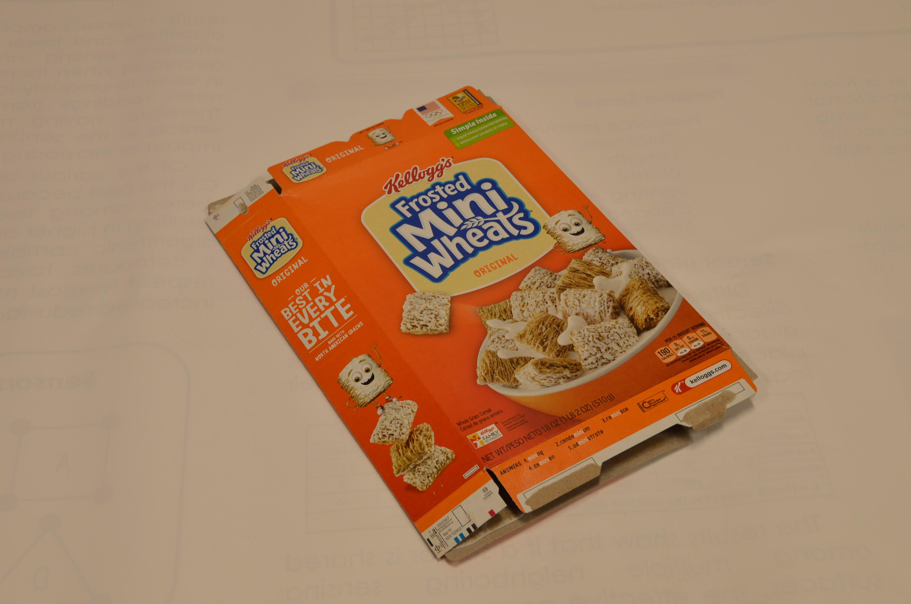
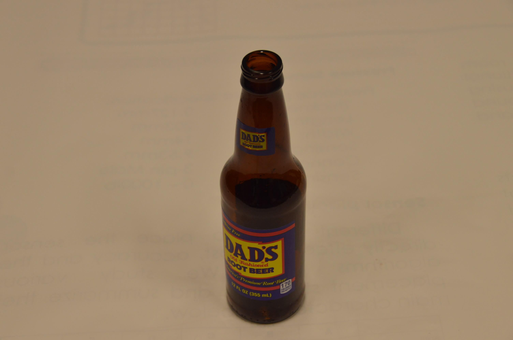
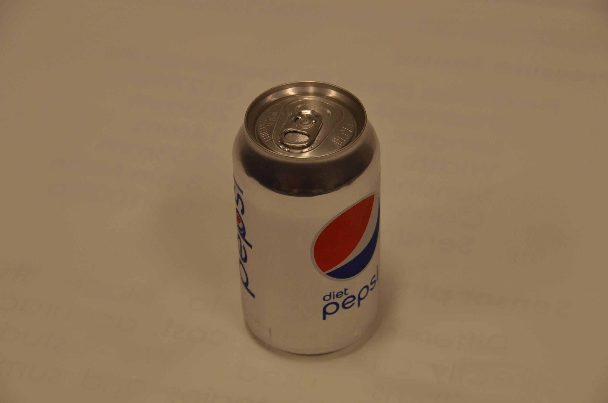
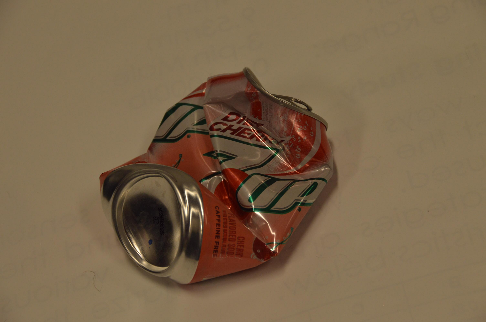
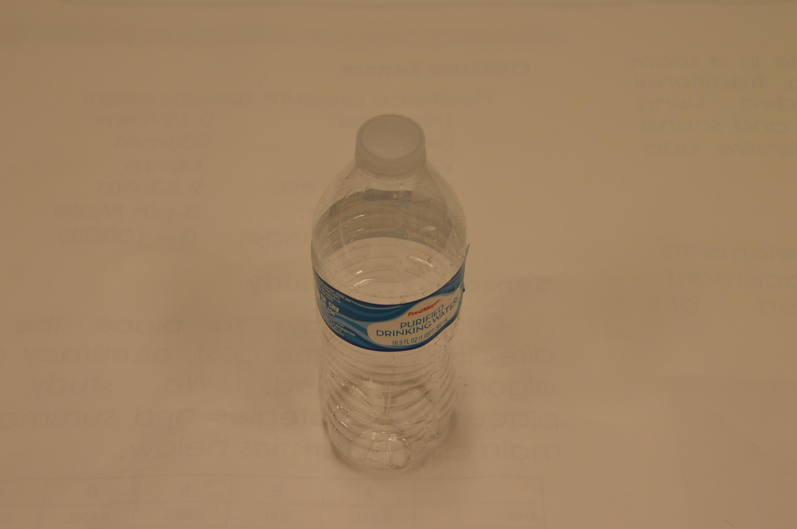
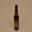

# Q.U.A.S.A.R. - Quantum Automated System for Advanced Recycling

## Table of Contents

-   [Motivation](#Motivation)
-   [Project description](#Porject-description)
-   [How it works](#How-it-works)
-   [Model Performance](#Model-Performance)
-   [Set up](#Set-up)
-   [Acknowledgements](#Acknowledgements)

## Motivation

In the United States, the production of solid waste has been on a continuous upward trajectory, reaching an annual average of approximately 292.4 million tons of municipal solid waste (MSW) as of 2020. Notably, the most significant portion of this waste stream comprises paper and paperboard materials.

Despite significant progress made through recycling and composting initiatives, a substantial challenge persists. In 2018, an admirable 94 million tons of MSW were successfully recycled, and an additional 35 million tons were converted into valuable compost for energy generation. Nevertheless, a significant amount of waste, totaling 146 million tons, found its way to landfills, representing a critical area where further sustainable solutions are needed.

Moreover, the emergence of quantum convolutional neural networks presents a groundbreaking opportunity to address these waste management challenges. QCNNs harness the unparalleled computational power of quantum computing, potentially surpassing the capabilities of classical CNNs. By integrating quantum technology into recycling systems, we aim to redefine the efficiency and accuracy of material classification. Qausar is driven by the belief that quantum computing can lead us to innovative breakthroughs in recycling technology, allowing us to reduce waste, conserve resources, and move closer to a more sustainable future.

## Project description

The future of recycling systems is at an exciting crossroads, where cutting-edge technology intersects with environmental sustainability. In this pioneering project, we at Qausar (Quantum Automated System for Advanced Recycling) delve into the realm of quantum convolutional neural networks (QCNNs) to revolutionize recycling efficiency and accuracy, surpassing the capabilities of traditional convolutional neural networks (CNNs). Our research centers on the development of two distinct models: a classical CNN and a quantum CNN, aiming to determine whether QCNNs can pave the way for a more sustainable recycling paradigm.

## How it works

Our machine learning algorithm is built upon the Quantum Convolution Neural Network. Unlike the conventional Convolutional Neural Network, which employs classical convolution techniques, our approach harnesses the advantages of quantum computing to extend the concept of classical convolution. The process for achieving quantum convolution unfolds as follows:

We begin by embedding a small image region (typically a 2 by 2 square in our implementation) into a quantum circuit. This is accomplished through parametrized rotations applied to qubits initialized in the ground state.

Subsequently, we apply a layer of a random unitary circuit, denoted as U, to the qubits obtained in the previous step.

Following this, we measure the quantum system, resulting in a collection of classical expectation values. Each of these expectation values is then mapped to a distinct channel within a single output pixel.

We repeat this procedure across all regions of the image until the entire image has been scanned. The result is an output object structured as a multi-channel image.

Finally, classical neural network layers are applied to the processed image.

## Model Performance

We compared the performance of classical model and quantum model under the same parameters using various metrics.

Our performance comparision strongly supports the adoption of the quantum machine learning model for tasks where speed, accuracy, and model size efficiency are paramount. However, we acknowledge that addressing the loss metric remains a challenge and an area for potential improvement in future developments. These findings underscore the promising potential of quantum machine learning in various real-world applications and motivate further research to harness its strengths while mitigating its limitations.

## Data

The data used was rescaled and converted from original images to numpy arrays and stored in the dataset folder.

|          |                        1                        |                        2                        |                        3                        |                        4                        |                        5                        |
| :------: | :---------------------------------------------: | :---------------------------------------------: | :---------------------------------------------: | :---------------------------------------------: | :---------------------------------------------: |
| Original |  |  |  |  |  |
| Rescaled |  |  |  |  |  |

## Set up

The code, model can be downloaded from (releases)[https://github.com/1mpossible-code/quasar/releases] tab.

Additionally, the PyPi package can be installed to access [Quasar.py](https://github.com/1mpossible-code/quasar/blob/5c6b9ff9319ddaac8e55c204b1a1543f66a62666/app/src/Quasar.py) created for easy access by our team.
The documentation is in progress, so for now, you can use the code as a reference.

```bash
pip install quantum-automated-system-for-advanced-recycling
```

[Python Example](./app/src/package/Quasar/example.py)

```python3
from Quasar import Quasar
import numpy as np

# Load data sets for training and testing
# Datasets can be accessed on releases page
train_dataset = np.load("./recycled_32_train.npz")
test_dataset = np.load("./recycled_32_test.npz")

# Create Quasar instance
model = Quasar(train_dataset, test_dataset)

# Preprocess images. It will save the pre-processed images to the directory specified.
model.preprocess("./quanvolution/")

# Load pre-processed images from numpy arrays
# q_train_images and q_test_images are default names
q_train_images = np.load("./quanvolution/q_train_images.npy")
q_test_images = np.load("./quanvolution/q_test_images.npy")

# Load the pre-processed images in the model
model.load(q_train_images, q_test_images)

# Train the model
model.train()

# Evaluate the model
model.evaluate()

# Print the prediction of the model on a single image
# It will output the index of the class with the highest probability and hardcoded name.
# In format {'name': prediction_result}
print(model.predict("./image.jpg"))
# {'Box': #}
```

## Acknowledgements

Core Devs: Team "rm -rf /": Maksym Yemelianenko, Qianxi Chen, Ilayda Dilek, Ethan Feldman, Karan Shah, Yufei Zhen

This project was created at the 2023 hAQathon ((AQ = AI + Quantum)) at NYU Tandon: the first quantum computing hackathon hosted at NYU Tandon.
